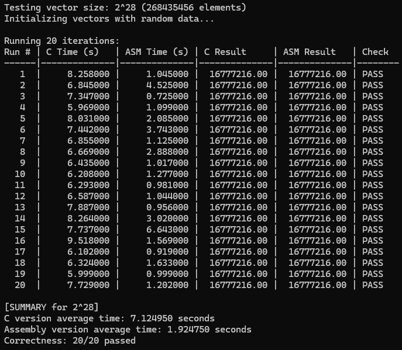
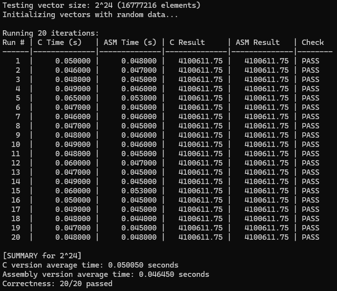
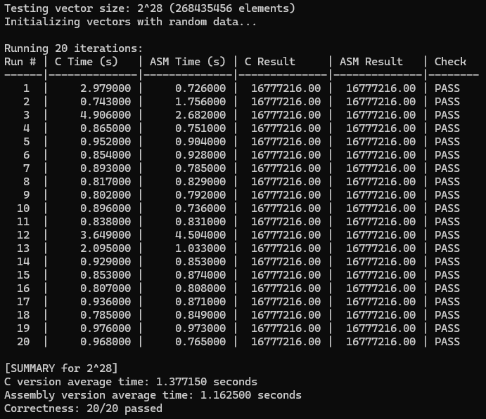

# Dot Product

Developed in partial fulfillment of the requirements for LBYARCH (Computer Organization and Architecture Laboratory) during Year 3, Term 1 of the Academic Year 2025-2026 at De La Salle University.

## Members

* NARVAJA, KATE ASHLEY ATACADOR
* PINEDA, MARK GABRIEL ALIPIO

## Project Specifications

Write the kernel in (1) C program and (2) an x86-64 assembly language. The kernel is to perform a dot product between vector A and vector B and place the result in _sdot_.

**Input**: Scalar variable `n` (integer) contains the length of the vector; Vectors A and B are both **single-precision float**. Scalar _sdot_ is a single-precision float.

**Process**: $sdot = \sum_{i=1}^{n} a_{i}b_{i} = a_{1}b_{1} + a_{2}b_{2} + ... + a_{n}b_{n}$

**Output**: Store the result in memory location sdot. Display the result for all versions of the kernel (i.e., C and x86-64).

## Usage

### Prerequisites

* NASM assembler
* C compiler (GCC or Visual Studio)

```bash
# Clone repository
git clone https://github.com/kthlrv/dot-product.git

# Run compile script
build.bat

# Or, open in Visual Studio
src/dot_product.sln
```

## Program Outputs

### Debug Mode




### Release Mode





## Execution Time/s

The relative performance difference between the C and ASM kernels is calculated using the formula: `(C_time - ASM_time) / C_time × 100%`

This metric quantifies the execution time improvement of the ASM kernel relative to the C kernel baseline. Positive values indicate ASM performance advantage, while negative values indicate C performance advantage.

[Reference](https://stackoverflow.com/questions/28403939/how-to-calculate-percentage-improvement-in-response-time-for-performance-testing)

### Debug Mode

| Vector Size | C Kernel (s) | ASM Kernel (s) | ASM Improvement vs. C |
| ----------- | ------------ | -------------- | --------------- |
| $2^{20}$ | 0.026300 | 0.003100 | +88.21% |
| $2^{24}$ | 0.382600 | 0.046600 | +87.82% |
| $2^{28}$ | 7.124950 | 1.924750 | +72.99% |

### Release Mode

| Vector Size | C Kernel (s) | ASM Kernel (s) | ASM Improvement vs. C |
| ----------- | ------------ | -------------- | --------------- |
| $2^{20}$ | 0.003500 | 0.004450 | -27.14% |
| $2^{24}$ | 0.050050 | 0.046450 | +7.19% |
| $2^{28}$ | 1.377150 | 1.162500 | +15.59% |

## Analysis

This performance analysis compares the execution of a dot product kernel implemented in both C and x86-64 assembly across varying vector sizes and compiler optimization levels. In **debug mode**, where compiler optimizations are minimal, the assembly kernel shows a substantial and consistent performance advantage. For a vector size of 2^20, the C kernel averages 0.026300 seconds while the assembly kernel completes in just 0.003100 seconds, which is an 88% improvement. This trend continues with larger data sets; at 2^24 elements, the assembly kernel's time of 0.046600 seconds is 88% faster than the C kernel's 0.382600 seconds, and at 2^28 elements, the assembly kernel maintains a strong lead, finishing in 1.925 seconds against the C kernel's 7.125 seconds, being a 73% improvement.

However, the performance shifts notably in **release mode**, where the compiler applies aggressive optimizations to the C code. For the smallest vector size of 2^20, the situation reverses, with the C kernel now finishing in 0.003500 seconds, outperforming the assembly kernel's 0.004450 seconds by 27%. This suggests that for smaller workloads, the overhead of the assembly function call may outweigh its computational benefits when compared to a potentially inlined and highly optimized C loop. As the vector size increases to 2^24, the assembly kernel regains a slight edge, finishing in 0.046450 seconds compared to the C kernel's 0.050050 seconds, a 7% improvement.

## Video Demo

